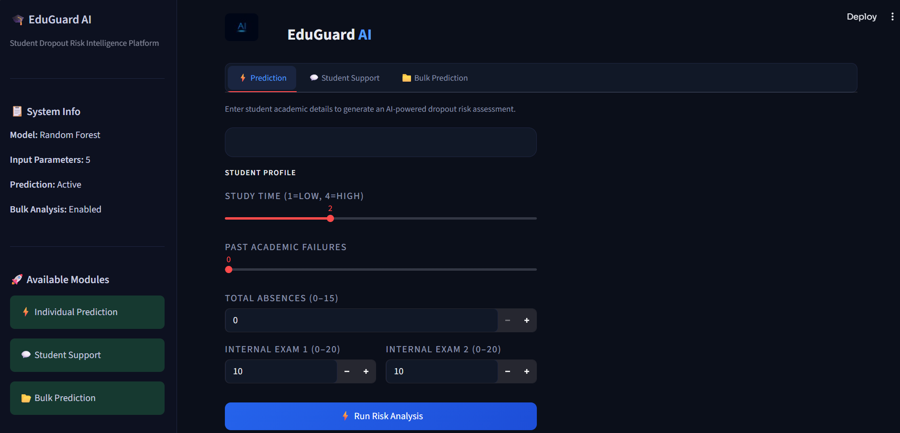

# 🎓 EduGuard AI

## AI-Powered Student Dropout Risk Prediction System

EduGuard AI is a machine learning-based web application that helps educational institutions identify students who are at risk of dropping out. The system analyzes academic performance, attendance, and previous failures to generate risk predictions and provide actionable recommendations.

---

🚀 Live Demo

https://eduguard-ai-2026.streamlit.app

---

## 🚀 Features

### ⚡ Individual Student Prediction

* Predict dropout risk for a single student
* Risk score percentage
* Risk gauge visualization
* Personalized recommendations
* PDF report generation

### 💬 Student Support Assistant

* AI-powered chatbot using Groq LLM
* Academic guidance
* Motivation and study support
* Student counselling assistance

### 📂 Bulk Student Prediction

* Upload CSV or Excel files
* Predict risk for multiple students
* Identify high-risk students
* Download prediction reports
* Automatic column mapping support

  ---

## 🧠 Machine Learning Model

* Algorithm: Random Forest Classifier
* Features Used:

  * Study Time
  * Academic Failures
  * Absences
  * Internal Mark 1 (G1)
  * Internal Mark 2 (G2)
    
---

## 🛠️ Technology Stack

* Python
* Streamlit
* Scikit-learn
* Pandas
* NumPy
* Plotly
* ReportLab
* Groq API

  ---

## 📁 Project Structure

```text
EduGuard-AI/
│
├── app.py
├── requirements.txt
├── dropout_model.pkl
├── dataset.csv
├── README.md
├── prediction_tab.png
├── student_support_tab.png
└── bulk_prediction_tab.png
```

---

## 📸 Application Screenshots

### Prediction Module



### Student Support Assistant


### Bulk Prediction


---

## 🎯 Real-World Applications

* Student dropout prevention
* Academic performance monitoring
* Early intervention systems
* Educational analytics
* Student counselling support

---

## 👩‍💻 Developed By

Sowmiya N
